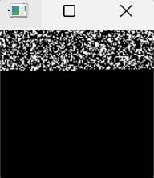

# Decoding the Invisible: Leveraging a Modified U-Net Architecture to Detect Image Steganography
***Author:* Ariana Huhko, SUNY Polytechnic Institute**  

## Objective
This project aims to explore AI's role in cybersecurity, particularly in the area of image steganalysis, to determine whether a network can detect the presence of hidden data within a carrier image (the resulting image after steganography has been applied). A customized U-Net architecture was developed to identify messages embedded via LSB encoding, using a PNG image dataset. The model leverages robust feature extraction and anomaly detection capabilities to enhance detection performance. We assess the network's accuracy in detecting hidden messages with the methods used and decode the embedded data as necessary.

## Datasets
The images used for the Basic LSB Encoder and Decoder were personally obtained.

The dataset used in the AI steganalysis model was obtained from: `https://www.kaggle.com/datasets/pankajkumar2002/random-image-sample-dataset`.

## Basic LSB Demo
To see a basic demonstration of how LSB works, look at the LSBDemo folder.

Run the following scripts in order:
- `resize_images.py`
- `BasicLSBEncoder.py`
- `BasicLSBDecoder.py`

**Original:**  
  

**Encoded:**  

## Preprocess Data
Download a dataset of images or use the one referenced for this project at https://www.kaggle.com/datasets/pankajkumar2002/random-image-sample-dataset. Unzip the dataset into your current repository. You should now see a `data` folder in your repository.

*If using a personal dataset - if the dataset is broken down into subsections, additional modifications will have to be made to the scripts. The scripts assume the filepath given contains only images, no other subfolders.* 

Run the following scripts after obtaining the dataset:
- `preprocess.py`
- `encode_stego.py` 
- `split_dataset.py`

## AI Steganalysis Model
### Training
To train the model, run the `train.py` script. 

The model will be saved at the epoch with the highest validation accuracy that has a validation loss of less than 1.0.

### Testing
To test the model, run the `test.py` script. 

The script will produce a more detailed output file, called `output_log.txt`, that will contain the current metrics and the decoded output of the images that were detected to have a hidden message. False negatives (images that were not detected to have a hidden message but were encoded) will also be decoded. The previous log file, if it exists, is overwritten.

### Other
The `image_difference.py` script will show a visual difference between the pixels of the original and the encoded image. A randomly selected image was used to test.

## Dependencies
- Python 3.10
- Tensorflow 2.11
- NVIDIA GPU + CUDA CuDNN

*A conda envoronment was used for this project. To set one up with the necessary dependencies, run the following commmands. Download either conda or miniconda first.*

`conda create -n Stego python=3.10`

Acitvate the environment by running:

`conda activtate Stego`

To install cuda:  
- `conda install -y -c conda-forge cudatoolkit=11.8.0`
- `pip install nvidia-cudnn-cu11==8.9.4.25`  

To install tensorflow:  
- `pip install "tensorflow<2.11"`

Find the folder where your environment is located (can be found by running `conda env list` in your terminal). Inside this folder, under `etc\conda\activate.d`, create a file `env_vars.bat`. If the folder path does not exist under your environment, copy this to a different file and move it in.

>@echo off
for /f "delims=" %%a in ('python -c "import nvidia.cudnn;print(nvidia.cudnn.\_\_file\_\_)"') do @set CUDNN_FILE=%%a
for %%F in ("%CUDNN_FILE%") do set CUDNN_PATH=%%~dpF
set PATH=%CUDNN_PATH%\bin;%PATH%

Verify that Tensorflow is working:

`python -c "import tensorflow as tf; print(tf.config.list_physical_devices('GPU'))"`

GPU devices should be listed as such:

`[PhysicalDevice(name='/physical_device:GPU:0', device_type='GPU')]`

Install additional dependencies/libraries as prompted:

- `pip install nltk`
- `pip install opencv-python`
- `pip install pillow`
- `conda install -y -c nvidia -c conda-forge -c defaults scikit-learn scikit-image matplotlib`